# WasteConnect — MERN Stack Architecture Guide & Defense Manual

This document provides a comprehensive breakdown of the **MERN (MongoDB, Express.js, React.js, Node.js)** architecture powering WasteConnect. It is structured to help you understand, demonstrate, and explain the codebase in project evaluations, viva, and technical interviews.

---

## 1. What is the MERN Stack in WasteConnect?

WasteConnect is built on the industry-standard four-tier **MERN Stack**, implemented in **pure JavaScript and React JSX**:

```mermaid
graph LR
    subgraph Frontend ["Frontend: React 18 + Vite (JSX)"]
        UI["React UI (Pages & Components)"]
        State["AuthContext & TanStack Query"]
        Axios["Axios HTTP Client"]
    end

    subgraph Backend ["Backend: Node.js + Express.js (ESM)"]
        Router["Express Routers (/api/*)"]
        AuthMiddleware["JWT & RBAC Middleware"]
        Controllers["Controllers (Business Logic)"]
    end

    subgraph Database ["Database: MongoDB Atlas"]
        Mongoose["Mongoose ODM Models"]
        Collections["Collections (Users, Pickups, Issues, Areas)"]
    end

    UI --> State
    State --> Axios
    Axios -- "HTTP / REST JSON" --> Router
    Router --> AuthMiddleware
    AuthMiddleware --> Controllers
    Controllers --> Mongoose
    Mongoose --> Collections
```



| Layer | Technology | Role in WasteConnect | Source Directory |
|---|---|---|---|
| **M** — MongoDB | MongoDB Atlas + Mongoose 8 | Multi-tenant cloud database storing Users, Pickup Requests, Civic Issues, Service Areas, Audit Logs, and Notifications. | `server/src/models/` |
| **E** — Express.js | Express.js 4 (REST API) | Route handling, authentication middleware, role-based authorization, rate limiting, and request validation with Zod. | `server/src/routes/` & `server/src/controllers/` |
| **R** — React.js | React 18 + Vite (JSX) | Modern Single Page Application (SPA) with declarative components, Tailwind CSS styling, React Router v6, and TanStack React Query. | `client/src/` |
| **N** — Node.js | Node.js (v18–v22, ESM) | High-performance asynchronous runtime running the Express API server and seed scripts. | `server/src/server.js` |

---

## 2. Directory Structure (Pure JS & JSX)

```text
wasteconnect/
├── client/                     # Frontend (React 18 JSX + Vite + Tailwind CSS)
│   ├── src/
│   │   ├── api/                # Axios API service calls (auth, pickups, issues, admin)
│   │   ├── components/         # Reusable UI widgets, Leaflet Maps, and Modals
│   │   ├── contexts/           # AuthContext (JWT session state, login/logout)
│   │   ├── layouts/            # AppLayout (Role-based sidebars) & PublicLayout
│   │   ├── lib/                # axios.js (interceptors), utils.js (formatWeight, formatDate)
│   │   ├── pages/
│   │   │   ├── admin/          # UsersPage (+ Add User), Dashboard, Pickups, Analytics
│   │   │   ├── authority/      # IssueQueue, Operations, CityMap, Hotspots
│   │   │   ├── citizen/        # MyPickups (Clean weights), RequestPickup, ReportIssue
│   │   │   ├── collector/      # AvailablePickups, MyPickups, CollectorHistory
│   │   │   └── auth/           # LoginPage (1-Click Demo & Google), RegisterPage
│   │   ├── App.jsx             # React Router v6 route configuration
│   │   └── main.jsx            # Application entrypoint
│   ├── vercel.json             # Vercel SPA rewrite rules (prevents 404s)
│   ├── vite.config.js          # Vite configuration
│   ├── tailwind.config.js      # Tailwind CSS theme configuration
│   └── package.json
│
├── server/                     # Backend (Node.js + Express.js in pure JavaScript)
│   ├── src/
│   │   ├── config/             # database.js (Mongoose connection), index.js (.env loader)
│   │   ├── controllers/        # Request handlers (authController, adminController, etc.)
│   │   ├── middleware/         # auth.js (JWT verify), authorize.js (RBAC), errorHandler.js
│   │   ├── models/             # Mongoose schemas (User, PickupRequest, PublicIssue, etc.)
│   │   ├── routes/             # Express routes (/auth, /citizen, /collector, /authority, /admin)
│   │   ├── seed/               # Mock dataset with authentic Indian personas and clean weights
│   │   ├── services/           # authService, pickupService, hotspotService
│   │   ├── app.js              # Express app initialization with Helmet & CORS
│   │   └── server.js           # Server entrypoint with auto-initialized default Admin
│   └── package.json            # Node.js ES Modules ("type": "module")
│
├── vercel.json                 # Root Vercel SPA rewrite configuration
├── QUICK_START_AND_DEPLOY.md   # Deployment cheat sheet
└── README.md                   # Project documentation
```

---

## 3. Key Architectural Features & Solutions

### A. Instant Personal Email & "Sign in with Google" Flow
- Users can log in using their personal email (Gmail, Outlook, personal) without password complexity friction.
- Endpoint `POST /api/auth/google` looks up the email:
  - If existing: returns their JWT token and profile immediately.
  - If new: automatically creates a Citizen account and logs them in seamlessly.

### B. Admin User Management (+ Add User)
- Admins have full platform visibility and can add new users directly via the "+ Add New User" modal in `UsersPage.jsx`.
- Endpoint `POST /api/admin/users` allows creating **Citizen**, **Collector**, **Municipal Authority**, or **Admin** accounts with assigned Service Areas/Wards.

### C. Clean Decimal Weight Handling
- Eliminates ugly raw floating-point numbers like `9.57643536440615 kg`.
- Centralized `formatWeight(qty, unit)` helper rounds cleanly to 1 or 2 decimals (e.g. `9.58 kg`, `10.9 kg`).
- Seed script rounds all generated quantities using `Math.round(val * 10) / 10`.

### D. Single Page Application (SPA) Vercel 404 Routing Fix
- In Vite + React SPAs, refreshing or directly navigating to sub-routes (e.g. `/login` or `/admin/dashboard`) on Vercel returns 404 unless rewrites are specified.
- `client/vercel.json` and root `vercel.json` rewrite all requests (`/(.*)`) to `/index.html`.
- Axios response interceptor prevents unconditional hard browser refreshes on 401 errors.

### E. Authentic Indian Municipal Seed Dataset
- Includes realistic Indian names: Aarav Sharma, Priya Patel, Rohit Verma, Ananya Iyer (Citizens); Vikram Singh, Rajesh Kumar, Sunil Yadav (Collectors); Neha Gupta, Arjun Deshmukh (Municipal Authorities); Rajiv Mehta, Pooja Malhotra (Admins).
- Realistic addresses like MG Road, Station Road, Nehru Nagar, Sector 14, and Industrial Area.

---

## 4. How to Run Locally

### Start Backend
```powershell
cd server
npm run dev
# Or run with node directly:
node src/server.js
```
- API Base URL: `http://localhost:5000/api`
- Health check: `http://localhost:5000/api/health`

### Start Frontend
```powershell
cd client
npm run dev
```
- Web Application: `http://localhost:5173`

### Re-seed Database with Clean Data
```powershell
cd server
npm run seed
```

---

## 5. Ready-to-Use Demo Credentials

| Role | Person Name | Email | Password |
|---|---|---|---|
| **Admin** | Rajiv Mehta | `admin@wasteconnect.in` | `Admin@123!` |
| **Admin (Legacy)** | System Admin | `admin@wasteconnect.io` | `Admin@123!` |
| **Authority** | Neha Gupta | `neha.gupta@greenfield.gov.in` | `Password123!` |
| **Collector** | Vikram Singh | `vikram.singh@wasteconnect.in` | `Password123!` |
| **Citizen** | Aarav Sharma | `aarav.sharma@example.com` | `Password123!` |
| **Citizen** | Priya Patel | `priya.patel@example.com` | `Password123!` |
